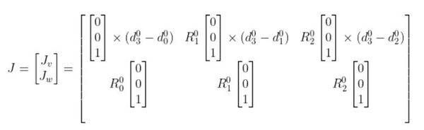

# Kinematics Homework 3 

## Setup & Installation


## How it work

### Robot Setup


Convert robot configuration into MDH for check answer with robotics-toolbox


### Question 1

The Jacobian matrix \(J\) is expressed as:

$$
J = 
\begin{bmatrix}
J_v \\
J_w
\end{bmatrix}_{6 \cdot n}
$$


### The RRR Robot Jacobian Matrix

The Jacobian matrix \(J\) is expressed as:




We use two equation above to construct Jacobian matrix for function below

```bash 
def endEffectorJacobianHW3(q: list[float]) -> np.ndarray:

    # Assign variable from Forward kinematics
    R, P, R_e, p_e = FKHW3(q) 

    # Assign position and rotation matrix
    p_01 = P[:,0]
    p_02 = P[:,1]
    p_03 = P[:,2]
    p_0e = p_e
    
    R_01 = R[:,:,0]
    R_02 = R[:,:,1]
    R_03 = R[:,:,2]
    R_0e = R_e
    
    # Crate array vector [0,0,1] Rotation around Z axix
    z = np.array([0.0, 0.0, 1.0]).reshape(3,1)
    
    # Create rotation axis frame
    z_01 = R_01 @ z
    z_02 = R_02 @ z
    z_03 = R_03 @ z
    # z_0e = R_0e @ z
    
    # Compute linear velocity Jacobian components
    Jv_1 = np.cross(z_01.T, (p_0e - p_01).T).T
    Jv_2 = np.cross(z_02.T, (p_0e - p_02).T).T
    Jv_3 = np.cross(z_03.T, (p_0e - p_03).T).T

    # Combine linear velocity components into J_v 
    J_v = np.hstack([Jv_1, Jv_2, Jv_3])
    
    # The angular velocity Jacobian components in J_w
    J_w = np.hstack([z_01, z_02, z_03])
    
    # Construct full Jacobian Matrix with Linear and Angular velocity
    J = np.vstack([J_v, J_w])
    
    return J
```


### Question 2

### Determinant Condition

The condition for the determinant of the Jacobian matrix is:


Find Singularity from find determinant of reduce jacobian matrix that < threshold (0.0001), return 0 if it not in singularity and 1 if near singularity

```bash 
def checkSingularityHW3(q:list[float])->bool:
    # Find Jacobian matrix
    J_e = endEffectorJacobianHW3(q)
    
    # Only linear velocity effect to singularity
    J_e_reduced = J_e[:3, :3] 
    
    # Find Determinant 
    det_J_e = np.linalg.det(J_e_reduced)

    # Check Singularity with threshold 0.01
    if (abs(det_J_e) < 0.001):
        return 1 
    else:
        return 0 
```


### Question 3

The torque equation is given by:

$$
\tau = J^T \cdot w
$$
τ : the vector of joint torques/efforts.

J_T  : the transpose of the Jacobian matrix.

w : the wrench applied to the end-effector.
Find Effort / Torque for each joint from above equation

```bash
def computeEffortHW3(q:list[float], w:list[float])->list[float]:
    """
    Use -J_3*w because the joint torques represent reaction forces opposing 
    the applied wrench on the end-effector, following Newton's third law.

    """
    
    # Find Jacobian Matrix
    J_e = endEffectorJacobianHW3(q)
    
    # Transpose Jacobian
    J_e_Transpose = J_e.T 

    # Find Effort from tau = J_e_transpose * w
    tau = np.dot(-J_e_Transpose, w) 
    
    return tau
```


## Answer Checking

### Question 1

```bash
def check_jacobian(q: list[float]):
    # Assign Jacobian matrix from our Jacobian compute and "jacob0" from robotics toolsbox
    jacob_our = endEffectorJacobianHW3(q)
    jacob_rtb = robot.jacob0(q)

    # Find difference 
    diff_Jacobian = jacob_rtb - jacob_our

    # Create Threshold 
    threshold = 1e-15
    error = np.where(np.abs(diff_Jacobian) < threshold, 0, diff_Jacobian)
    
    print("#Number 1")
    print(f"Input q : {q}")
    print(f"Our Jacobian : \n {jacob_our} \n")
    print(f"Robotics toolsbox Jacobian : \n {jacob_rtb} \n")
    print(f"Difference of our and toolsbox : \n {error}")

    return error
```
    Input q : q that we need to know the jacobian

    Our Jacobian : Jacobian Matrix from handcraft jacobian

    Robotics toolsbox Jacobian : Jacobian Matrix from .jacob0 robotics-toolsbox

    Difference of our and toolsbox : difference Jacobian matrix from 2 method

### Output


### Question 2
```bash
def check_singularity(q: list[float]):
    # Assign Singularity check output from our function
    our_sin = checkSingularityHW3(q)
    
    # Define jacobian and compute Singularity by determinant
    J = robot.jacob0(q)
    J_e_reduced = J[:3, :3] 
    det_J_e = np.linalg.det(J_e_reduced)
    
    # Condition check Singularity from robotics toolbox
    if (abs(det_J_e) < 0.001):
        sin = 1
    else:
        sin = 0 
        
    print("#Number 2")
    print(f"Input q : {q}")
    print(f"Singularity rtb : {sin}, our : {our_sin}")
    print("Near Singularity" if sin and our_sin else "Not Singularity")

    return sin and our_sin
```

    Input q : q that we need to know the jacobian
    flag : return "Singularity" or "Not Singularity" 

### Output


### Question 3
```bash
ef check_effort(q: list[float],w: list[float]):
    # Effort from our by J_transpose * w
    tau_our = computeEffortHW3(q,w)
    
    # Effort from robotics-toolsbox
    J = robot.jacob0(q)
    tau_rtb = robot.pay(w, J=J, frame=0)
    
    # Finding error
    error = tau_rtb - tau_our
    
    # Create Threshold 
    threshold = 1e-15
    error = np.where(np.abs(error) < threshold, 0, error)
    print("#Number 3")
    print(f"Input q: {q}, Input w: {w}")
    print(f"Our Effort : \n {tau_our} ")
    print(f"Robotics toolsbox Effort : \n {tau_rtb}")
    print(f"Difference of our and toolsbox : \n {error}")

    return error
```

    Input q, w : input q, w
    Our Effort : Torque compute from our function
    Robotics toolsbox Effort : Torque compute from robotics-toolsbox
    Difference of our and toolsbox : difference value from this 2 method
    
### Output


